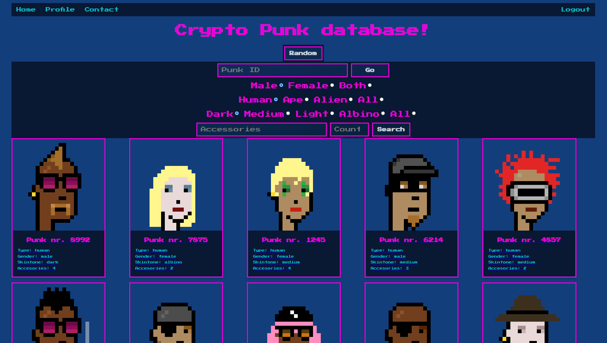

# NFT database - Track your favourite punk!

# running dis-nft-project:

Assumes a working Python 3 installation (with python=python3 and pip=pip3).

(1) Run the code below to install the dependencies.
>$ pip install -r requirements.txt

(2) Initialize the database, by running the SQL files (Creating the necessary tables) 
IMPORTANT: In the 'Create Attributes.SQL' change the directory to the full path of the 'attributes.csv' file. 

(3) In the app.py-file, set your own database username and password

(4) Run Web-App
>$ python src/app.py

----------------------------------------------------------------------------------------------

# How to use the application:

(1) Create account / You start by pressing the 'Create Account' button, you then get to page where you choose your username and password.

(2) Login / Now you can login on your account by typing in your username and password.

(3) Frontpage / On the frontpage you will see 10 random NFT's (cryptopunks) and some different filter options.

(4) Punks / Each punk have their own page where you can see 'attributes', price and you have the option to add the punk to your favourites.

(5) Searching / You can get to a random punk by pushing the 'random' button, you will also have the option to type in the 'punk ID'.
		On the frontpage the searching is made easy by types you can choose. It can e.g. be a 'male', 'human', 'medium' skin color, 
		then you can type in some specific 'accessories' and at last choose the amount of accessories the punk should have.
		
(6) Accessories / Under 'accessories' you can search for a lot of things e.g. "mohawk", "beard", "earring", "cigarette", "lipstick", "glasses",
		  "nerd glasses", "bandana", "eye patch", "VR", "3D glasses", specfic colors like "green" and etc.

(7) User page / Each user have their own individual page where they can see their favourite punks.

(8) Contact / At last we have a 'contact' page so you have an option to contact the three founders and thank them for their awesome work!

